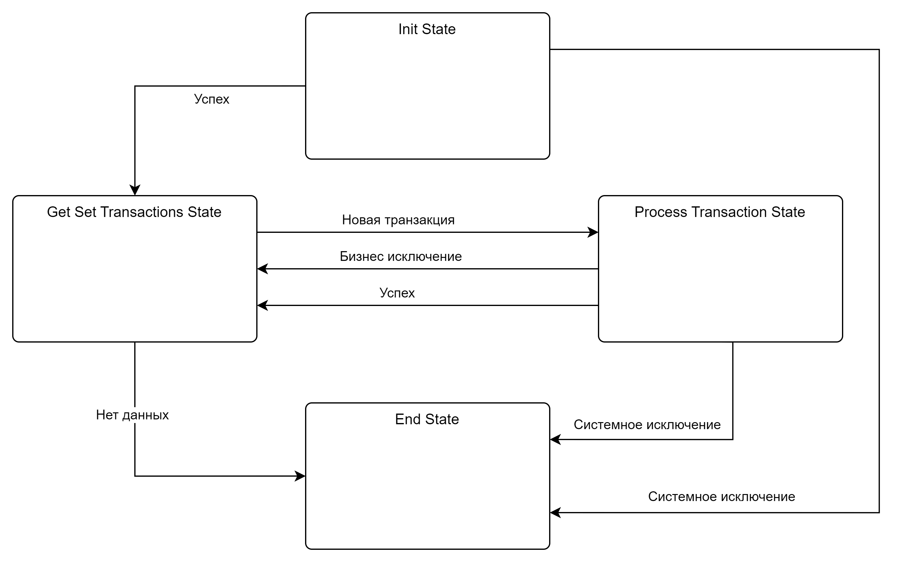
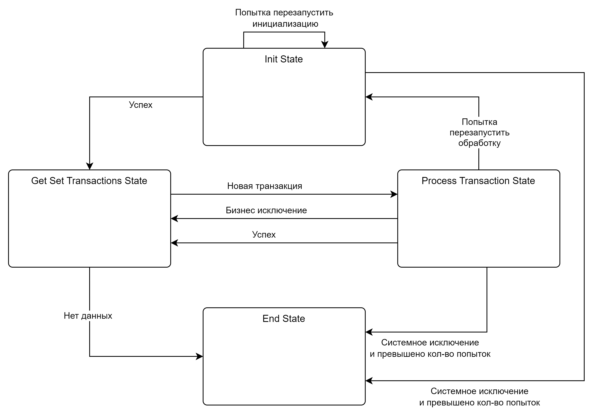

# Шаблоны для роботов PIX RPA

## Содержание
- [Описание](#описание)
- [Структура названия шаблонов](#структура-названия-шаблонов)
- [Каталог шаблонов](#каталог-шаблонов)
- [Функциональные возможности](#функциональные-возможности)
- [Схемы работы шаблонов](#схемы-работы-шаблонов)
- [Руководство по выбору шаблона](#руководство-по-выбору-шаблона)
- [Начало работы](#начало-работы)
- [Часто задаваемые вопросы](#часто-задаваемые-вопросы)

## Описание

Данный репозиторий содержит набор готовых шаблонов для разработки роботов на платформе PIX RPA. Шаблоны предназначены для ускорения разработки, обеспечения стандартизации кода и повышения надежности решений.

Каждый шаблон предоставляет структурированный подход к автоматизации бизнес-процессов и включает встроенные механизмы для обработки исключительных ситуаций, логирования и уведомлений.

## Структура названия шаблонов

Каждый шаблон именуется согласно следующей структуре:

```
PIX-{ТИП Шаблона}-{ТИП Транзакции}-{ТИП Оповещения}
```

### Тип шаблона

| Обозначение | Описание |
|-------------|----------|
| **SM** | **S**tate **M**achine - шаблон на основе конечного автомата. Состоит из 4 основных состояний: Init, Get/SetTransaction, Processing, EndProcessing |
| **R** | **R**etry - шаблон с встроенными механизмами повторения операций при сбоях (в стейтах Init и Processing). Обеспечивает отказоустойчивость, позволяя перезапускать приложения и продолжать обработку транзакций с места сбоя |
| **UI** | **U**ser **I**nterface - шаблон для работы с пользовательским интерфейсом приложений. При сбоях автоматически делает и прикрепляет скриншот к уведомлению |

### Тип транзакции

| Обозначение | Описание |
|-------------|----------|
| **RQ** | **R**ead **Q**ueue - чтение транзакций из очереди данных оркестратора (Мастера) |
| **RWQ** | **R**ead-**W**rite **Q**ueue - чтение транзакций из очереди оркестратора и запись результатов в другую очередь |
| **F** | **F**ile - работа с файлами (из FTP или сетевой папки) в качестве источника транзакций |
| **M** | **M**ail - использование электронных писем в качестве транзакций |
| **LT** | **L**ist<**T**> - использование типизированных списков объектов |
| **R** | **R**ow - обработка строк из таблицы данных |

### Тип оповещения

| Обозначение | Описание |
|-------------|----------|
| **A** | **A**dmin - оповещение администраторов системы |
| **E** | **E**xchange - оповещение через Microsoft Exchange |
| **S** | **S**MTP - оповещение через SMTP-сервер |
| **U** | **U**ser - оповещение пользователей системы |

## Каталог шаблонов

### Шаблоны для работы с очередями данных (запись результатов)

| Шаблон | Описание |
|--------|----------|
| **PIX-SMRUI-RWQ-EAU** | Автомат с повторами, работа с UI, чтение/запись в очередь, уведомления через Exchange для админов и пользователей |
| **PIX-SMR-RWQ-EAU** | Автомат с повторами, чтение/запись в очередь, уведомления через Exchange для админов и пользователей |
| **PIX-SM-RWQ-EAU** | Базовый автомат, чтение/запись в очередь, уведомления через Exchange для админов и пользователей |

### Шаблоны для работы с очередями данных (только чтение)

| Шаблон | Описание |
|--------|----------|
| **PIX-SMRUI-RQ-EAU** | Автомат с повторами, работа с UI, чтение из очереди, уведомления через Exchange для админов и пользователей |
| **PIX-SMR-RQ-EAU** | Автомат с повторами, чтение из очереди, уведомления через Exchange для админов и пользователей |
| **PIX-SM-RQ-EAU** | Базовый автомат, чтение из очереди, уведомления через Exchange для админов и пользователей |

### Шаблоны для работы с файлами

| Шаблон | Описание |
|--------|----------|
| **PIX-SMRUI-F-EAU** | Автомат с повторами, работа с UI, обработка файлов, уведомления через Exchange для админов и пользователей |
| **PIX-SMR-F-EAU** | Автомат с повторами, обработка файлов, уведомления через Exchange для админов и пользователей |
| **PIX-SM-F-EAU** | Базовый автомат, обработка файлов, уведомления через Exchange для админов и пользователей |

### Шаблоны для работы с электронной почтой

| Шаблон | Описание |
|--------|----------|
| **PIX-SMRUI-M-EAU** | Автомат с повторами, работа с UI, обработка писем, уведомления через Exchange для админов и пользователей |
| **PIX-SMR-M-EAU** | Автомат с повторами, обработка писем, уведомления через Exchange для админов и пользователей |
| **PIX-SM-M-EAU** | Базовый автомат, обработка писем, уведомления через Exchange для админов и пользователей |

### Шаблоны для работы со списками объектов

| Шаблон | Описание |
|--------|----------|
| **PIX-SMRUI-LT-EAU** | Автомат с повторами, работа с UI, обработка списков объектов, уведомления через Exchange для админов и пользователей |
| **PIX-SMR-LT-EAU** | Автомат с повторами, обработка списков объектов, уведомления через Exchange для админов и пользователей |
| **PIX-SM-LT-EAU** | Базовый автомат, обработка списков объектов, уведомления через Exchange для админов и пользователей |

### Шаблоны для работы с табличными данными

| Шаблон | Описание |
|--------|----------|
| **PIX-SMRUI-R-EAU** | Автомат с повторами, работа с UI, обработка табличных данных, уведомления через Exchange для админов и пользователей |
| **PIX-SMR-R-EAU** | Автомат с повторами, обработка табличных данных, уведомления через Exchange для админов и пользователей |
| **PIX-SM-R-EAU** | Базовый автомат, обработка табличных данных, уведомления через Exchange для админов и пользователей |

## Функциональные возможности

Все шаблоны предоставляют следующие встроенные функциональные возможности:

| Функциональность | Описание |
|-----------------|----------|
| **Логирование** | Встроенная система журналирования действий и ошибок с различными уровнями детализации |
| **Обработка исключений** | Механизмы перехвата и обработки различных типов ошибок с возможностью настройки реакции |
| **Уведомления** | Гибкая система оповещений через различные каналы связи (Exchange, SMTP) |
| **Масштабируемость** | Возможность масштабирования решения для обработки большого количества транзакций |
| **Поддерживаемость** | Единая архитектура и структура кода для облегчения поддержки и развития |
| **Расширяемость** | Возможность добавления новых функциональных модулей без изменения основного кода |
| **Отчетность** | Формирование структурированных отчетов о выполнении процессов |
| **Мониторинг** | Встроенные метрики производительности и состояния |

## Схемы работы шаблонов

### Базовая схема State Machine (SM)



Базовая схема State Machine (SM) включает четыре основных состояния:

1. **Init State** - инициализация робота, подготовка ресурсов для работы.
2. **Get Set Transactions State** - получение и подготовка транзакций для обработки.
3. **Process Transaction State** - обработка каждой транзакции согласно бизнес-логике.
4. **End State** - завершение работы, освобождение ресурсов.

Переходы между состояниями происходят по следующим триггерам:
- **Успех** - успешное выполнение операции
- **Новая транзакция** - передача транзакции на обработку
- **Бизнес исключение** - ошибка в бизнес-логике
- **Системное исключение** - критическая ошибка системы
- **Нет данных** - отсутствие транзакций для обработки

### Схема с механизмом повторений (SMR)



Схема с механизмом повторений (SMR) расширяет базовую схему State Machine дополнительными путями для обеспечения отказоустойчивости:

1. **Попытка перезапустить инициализацию** - при возникновении проблем в начальной стадии работы
2. **Попытка перезапустить обработку** - при возникновении проблем в процессе обработки транзакции

Основные отличия от базовой схемы:
- Наличие механизма повторных попыток для стадий Init и Processing
- Настраиваемое количество повторов для каждого типа операций
- Переход в End State только после превышения лимита попыток
- Продолжение обработки с места сбоя после успешного повторного запуска

Шаблоны с механизмом повторений особенно полезны для длительных процессов обработки большого количества транзакций, обеспечивая возможность восстановления без потери данных и состояния.

## Руководство по выбору шаблона

Выбор подходящего шаблона зависит от трех основных факторов:

1. **Требуется ли работа с UI?**
   - Да: выбирайте шаблон с суффиксом UI (например, PIX-SMRUI-...)
   - Нет: выбирайте шаблон без суффикса UI

2. **Нужна ли отказоустойчивость с автоматическими повторами при сбоях?**
   - Да: выбирайте шаблон с компонентом R (например, PIX-SMR-...)
   - Нет: выбирайте базовый шаблон SM (например, PIX-SM-...)

3. **Какой источник данных используется для транзакций?**
   - Очередь в оркестраторе с записью результатов: RWQ
   - Очередь в оркестраторе без записи результатов: RQ
   - Файлы (FTP/сетевые папки): F
   - Электронные письма: M
   - Типизированные списки объектов: LT
   - Таблицы данных: R

## Начало работы

1. **Выбор шаблона**
   - Определите требования к проекту автоматизации
   - Выберите подходящий шаблон из каталога

2. **Настройка проекта**
   - Скачайте выбранный шаблон
   - Настройте параметры шаблона (входные параметры, учетные данные, пути)
   - Настройте параметры уведомлений

3. **Реализация бизнес-логики**
   - Реализуйте логику инициализации в секции **Init**
   - Настройте получение транзакций в секции **Get/SetTransaction**
   - Реализуйте основную логику обработки в секции **Processing**
   - Реализуйте завершающие операции в секции **EndProcessing**

4. **Тестирование и отладка**
   - Протестируйте робота на тестовых данных
   - Проверьте обработку исключительных ситуаций
   - Проверьте работу механизмов уведомлений

5. **Публикация и настройка**
   - Опубликуйте робота в оркестраторе
   - Настройте расписание выполнения
   - Настройте мониторинг и оповещения

## Часто задаваемые вопросы

### Когда использовать шаблоны с UI?
Шаблоны с UI (SMRUI) следует использовать, когда робот должен взаимодействовать с графическим интерфейсом приложений. Эти шаблоны включают механизмы для работы с элементами интерфейса и автоматически сохраняют скриншоты при возникновении ошибок.

### Когда нужны шаблоны с механизмом повторов (R)?
Шаблоны с механизмом повторений (SMR) рекомендуется использовать для процессов, критичных к сбоям, где необходимо автоматически восстанавливать работу и продолжать с места прерывания. Особенно полезны при обработке больших объемов данных.

### Можно ли комбинировать функциональность разных шаблонов?
Да, архитектура шаблонов позволяет расширять и комбинировать функциональность. Однако рекомендуется начинать с наиболее подходящего базового шаблона и добавлять нужные компоненты, а не создавать гибридные решения с нуля.

### Как настроить уведомления?
Все шаблоны поддерживают настройку уведомлений через конфигурационные параметры. Вы можете указать адреса получателей, шаблоны сообщений и условия отправки в соответствующем разделе конфигурации.

### Пример уведомления для администраторов

Шаблоны PIX RPA поддерживают HTML-форматирование в уведомлениях, что позволяет создавать информативные и структурированные сообщения об ошибках. Вот пример шаблона уведомления о критической ошибке для администраторов:

```html
<p>Здравствуйте, команда поддержки!</p>
<div>Произошла критическая ошибка в работе робота <strong>«Возврат палет»</strong></div>
<div>&nbsp;</div>
<div><strong>Код ошибки/трейсбэк:</strong></div>
<div>&nbsp;</div>
<div><strong>{systemError.ToString()}</strong></div>
<div>&nbsp;</div>
<div>Прошу оперативно рассмотреть проблему.
<div>С уважением,<br />Робот <strong>«Возврат палет»</strong></div>
</div>
```

В данном шаблоне:
- `{systemError.ToString()}` - переменная, которая будет заменена на текст ошибки во время выполнения
- HTML-форматирование позволяет выделять важные части сообщения жирным шрифтом
- Структура сообщения обеспечивает четкое представление о проблеме и источнике ошибки

Для настройки таких уведомлений в шаблонах с префиксом A (Admin) необходимо указать шаблон сообщения в параметрах конфигурации шаблона.

#### Пример уведомления с информацией о скриншоте

Для шаблонов с поддержкой UI (SMRUI) полезно включать информацию о прикрепленном скриншоте, который автоматически создается при возникновении ошибки:

```html
<p>Здравствуйте, команда технической поддержки!</p>
<div>Обнаружена ошибка в работе робота <strong>«Обработка счетов»</strong> на этапе взаимодействия с пользовательским интерфейсом.</div>
<div>&nbsp;</div>
<div><strong>Время возникновения ошибки:</strong> {errorTime}</div>
<div><strong>Транзакция:</strong> {transactionId}</div>
<div><strong>Действие:</strong> {currentAction}</div>
<div>&nbsp;</div>
<div><strong>Описание ошибки:</strong></div>
<div>{errorDescription}</div>
<div>&nbsp;</div>
<div><strong>Стек вызовов:</strong></div>
<div><code>{stackTrace}</code></div>
<div>&nbsp;</div>
<div><strong>Дополнительная информация:</strong></div>
<div>Во вложении к письму прикреплен скриншот экрана на момент возникновения ошибки. Скриншот сделан автоматически и может помочь в диагностике проблемы.</div>
<div>&nbsp;</div>
<div>Количество оставшихся попыток автоматического восстановления: <strong>{retriesLeft}</strong></div>
<div>&nbsp;</div>
<div>С уважением,<br />Система мониторинга роботов PIX RPA</div>
```

В этом шаблоне:
- `{errorTime}` - дата и время возникновения ошибки
- `{transactionId}` - идентификатор обрабатываемой транзакции
- `{currentAction}` - текущее действие, при выполнении которого произошла ошибка
- `{errorDescription}` - описание ошибки
- `{stackTrace}` - стек вызовов для точной диагностики
- `{retriesLeft}` - количество оставшихся попыток автоматического восстановления

Этот формат особенно полезен для UI-шаблонов (SMRUI), так как позволяет администраторам быстро определить причину сбоя, имея контекст операции и визуальное представление проблемы благодаря автоматически созданному скриншоту.

### Пример уведомления для пользователей

Для информирования конечных пользователей о временной недоступности робота можно использовать следующий шаблон:

```html
<p>Уважаемый(ая) {userName},</p>
<p>К сожалению, робот <strong>«{robotName}»</strong> временно недоступен из-за технического сбоя. Наши специалисты уже уведомлены и работают над устранением проблемы.</p>
<p><strong>Что это значит для вас?</strong></p>
<ul>
<li>{impactDescription}</li>
</ul>
<p><strong>Прогнозируемое время восстановления: </strong>{estimatedRecoveryTime}.</p>
<p>Приносим извинения за временные неудобства. Если у вас есть срочные вопросы, пожалуйста, свяжитесь с нами через {contactInfo}.</p>
<p>С уважением,<br />Ваша команда поддержки</p>
```

В данном шаблоне:
- `{userName}` - имя получателя уведомления
- `{robotName}` - название робота
- `{impactDescription}` - описание влияния сбоя на рабочие процессы (например, "Обработка заказов приостановлена")
- `{estimatedRecoveryTime}` - ориентировочное время восстановления работы
- `{contactInfo}` - контактная информация службы поддержки

Такой формат уведомления позволяет пользователям понять суть проблемы, её влияние на бизнес-процессы и ожидаемые сроки решения, что снижает количество обращений в службу поддержки и улучшает общее впечатление от автоматизированной системы.

Для настройки пользовательских уведомлений в шаблонах с префиксом U (User) необходимо указать шаблон сообщения и список получателей в параметрах конфигурации шаблона.